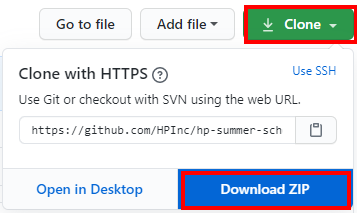

# Holistic View of Data to Drive Business Decisions

This repo contains the Jupyter notebooks and supporting materials for the
session on data and business insights.  

### Presentation Slides
See the slides here: [presentation/data-to-business-insights.pdf](presentation/data-to-business-insights.pdf). 

## Session Description

"Data has rapidly become one of the most critical elements driving business strategy.  At HP, we believe that creating,
 ingesting, securing, maintaining privacy, sharing and efficiently processing the data we collect and produce is the
  basis for innovating in our business.  The value of that data is realized when we make business decisions in
   the customers’ best interest.  How we govern data using policies, data sourcing, data operations, data hygiene,
    and analytics are critical.  We’ll include some short demos for some of the steps along the way, like data 
    cleansing and aggregation, and talk about the importance of taking a holistic view and keeping the data in context."

# Setup for Running the Notebooks

The code and notes for this course are contained in a set of Python-based Jupyter notebooks, and we use PostgreSQL
as the database for the analysis.  If you'd like to run it yourself, you'll need a few things installed.

## Clone or download this repo

If you already have Git installed, you can clone this repo directly.  Go to

https://github.com/HPInc/hp-summer-scholars-2020 and look for the green 'Clone' button.



If you don't have Git installed, you can choose 'Download ZIP' and unzip the files wherever you want on your machine.
## Install Anaconda

The [Anaconda](https://www.anaconda.com/) platform is a really easy way to get a Python 3 distribution and Jupyter
all in one package.  Install the [individual edition](https://www.anaconda.com/products/individual) on your
machine.

## Install PostgreSQL

Install Postgres from [here](https://www.postgresql.org/download/) and get it running.  When you 
set it up, you'll assign an administrator password; remember it, because you'll need it
when starting pgAdmin.

### PostgreSQL: Open the pgAdmin Tool

Once Postgres is installed and running, you can launch the admin tool for it so we can set some things up:


### PostgreSQL: Create a Sales Role

Add a role called **'sales'** with a password; you'll use it in Notebook 1.


### PostgreSQL: Create a 'sales' Database


Create the database with the name 'sales' and set the owner to the 'sales' role we created above.


## Create ```c:\keys\sales.properties```

This file will have the following format:
```
[database]
login=sales
password=<whatever password you created for the 'sales' role in Postgres>
```


Note: if you're on a **Mac or Linux machine**, you can put this file wherever you like.
  You'll need to change the file location in the code in a couple places, though:

- Open the Jupyter notebook titled **'1. FIPS Code and Population Data'** and look for this line: 


See the instructions below regarding Jupyter if you're not sure how to open a Jupyter notebook.  

- Look for that same entry in a file called **```jupyter_notebooks/my_connect.py```.**  You can
open this file with a text editor.

- Change the path in both places to wherever you saved your ```sales.properties``` file.

# Jupyter: How to Use the Notebooks

- From your Anaconda install, launch 'Jupyter Notebook':
  

  
The Jupyter service will start, and the Jupyter UI should come up in your browser.

## Jupyter: Open the '0. Introduction' Notebook

- From the Jupyter tab in your browser, in the 'Files' tab, 
navigate to the ```jupyter-notebooks``` folder of this repo and open ```0. Introduction.ipynb```


- To run all code in the notebook, do ```Cell - Run All``` from the top menu.  This will run each cell in sequence.
Some cells are documentation (markdown), some are code (Python).  As each cell runs, it'll show a * next to it 
while it's running, and a number when it's done.  

The output for each code cell appears just below the cell. The introduction notebook
 doesn't have any code cells, but the others do.


- Read the comments and see the output from each step.
- At the bottom of each notebook, there's a link to open the next one.
- Make sure you open the notebooks in order, and run each one before proceeding to the next.


